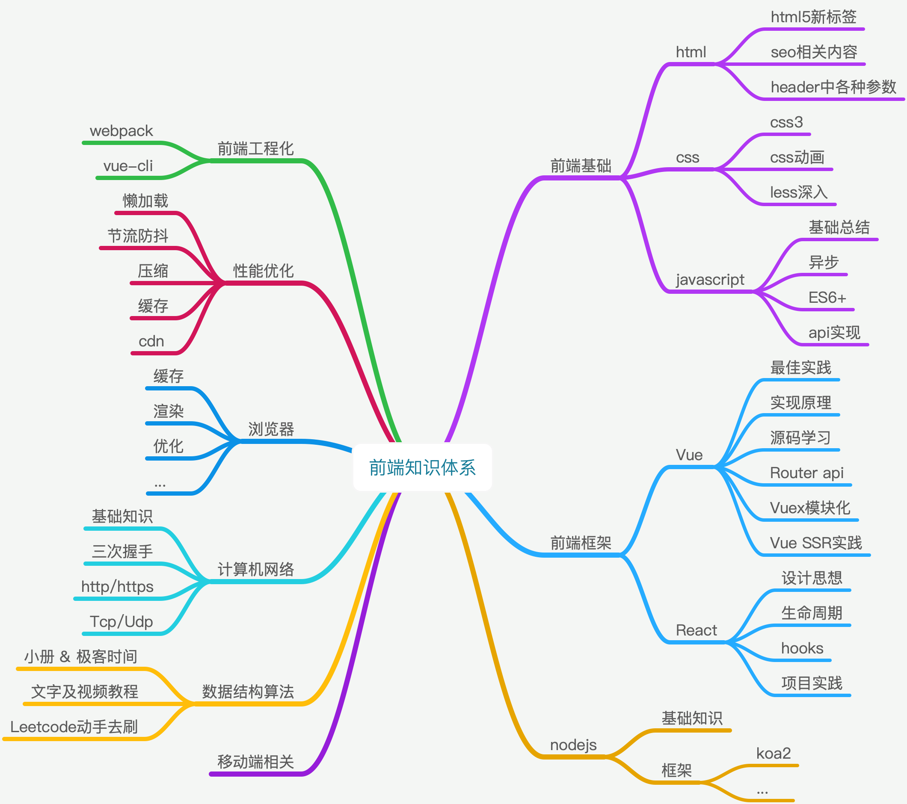

## hello, 欢迎 ~
这是一个小小的个人网站，是笔者在经历各种杂七杂八的破事、不断的自我怀疑下搭建的，主要用来写一些知识总结、拓展学习以及对自己的反思等等。当然作为一个个人小站点，也不会全放一些严肃的东西了，中间可能会穿插一些动漫、游戏的安利、截图什么什么的 ...

做前端差不多也有1年半的时间了[2018.12 - 2020.7.25]，初期上手算是相当慢了，还得感谢当年领导的耐心，否则现在可能又回老本行做机械去啦(笑)。中期也有好好学习补充过，奈何自己**眼高手低**，这看看那看看，根本没有形成知识体系。我想有些同学可能跟我有同样的感受：哎？这个东西我知道，**我看过**。具体怎么用、代码怎么实现以及需要注意什么问题从来没有去深入了解探究，跟人吹牛的时候也是挺虚的。

中间也看过工作，稍微面过几家公司的样子。现在回想起来发现自己有一种蜜汁自信，投的公司呢大多也是比较不错的，【感觉】自己进个不错的公司没什么问题一样。现实确实是很现实的，嗯… 跟人吹牛都虚的话，还怎么能好好的跟面试官吹呢。

碎碎念差不多就到这里吧，先搞一点计划整起：

看着有一丢丢乱，暂时先这样，计划的再好，还是要先行动起来。

再提醒自己一句：**自己总结出来的东西，才真正属于你。**